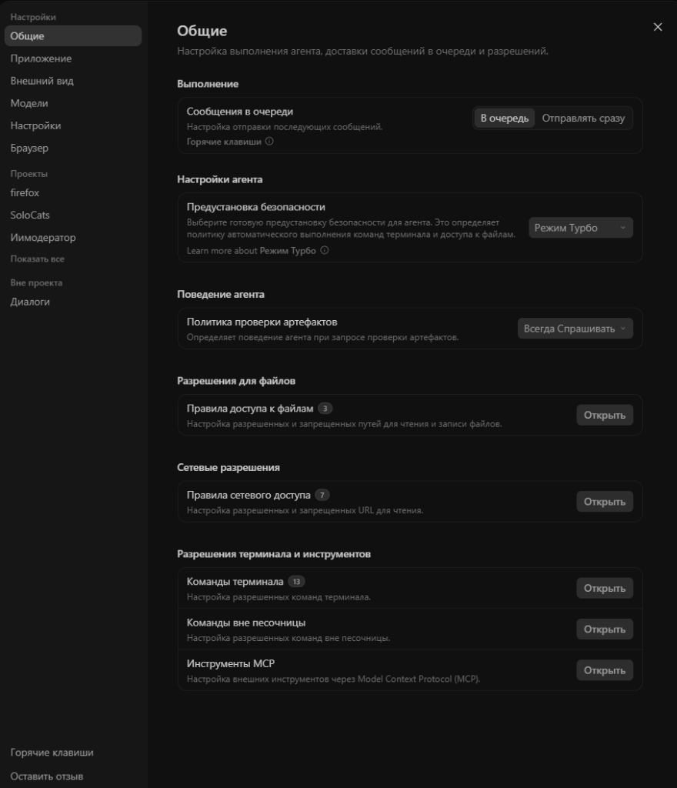
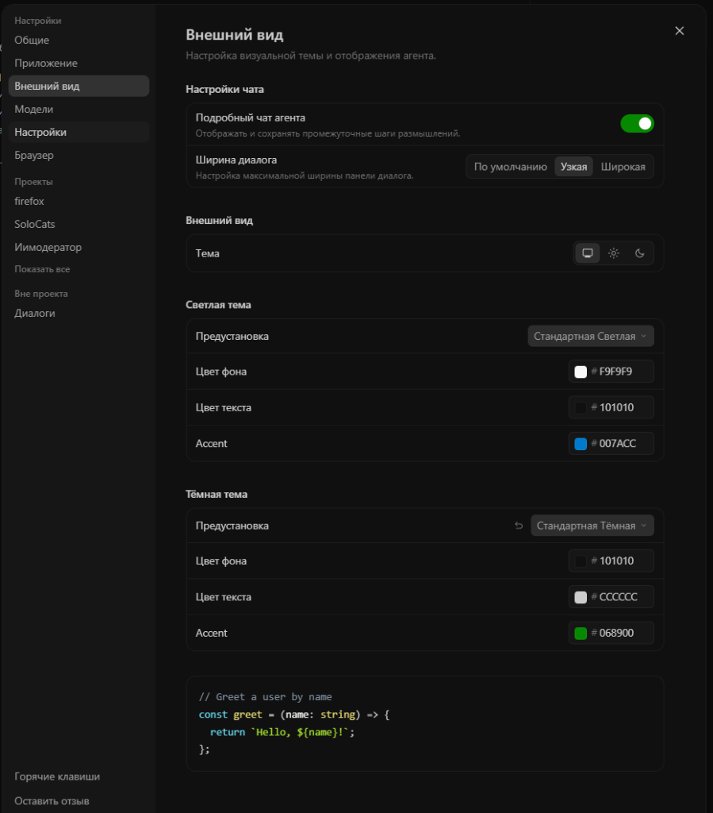
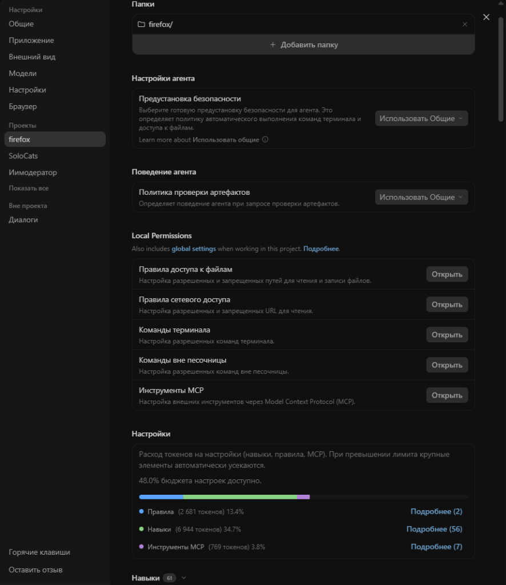

# Русификатор Antigravity 2 — Русский язык для Antigravity

Полный рабочий русификатор десктопного приложения **Antigravity 2** (Windows).  
Переводит интерфейс, все разделы настроек, профили безопасности, консольные меню и панель изменений на понятный русский язык.  
Протестировано и стабильно работает на версии **2.11.0**.

---

## Как установить русский язык (в 1 команду)

Откройте консоль PowerShell и вставьте одну строку:

```powershell
irm https://raw.githubusercontent.com/SPIDIKSY/antigravity-ru/main/install.ps1 | iex
```

Скрипт сам скачает необходимые файлы с GitHub, создаст резервную копию оригинального приложения и включит русский язык.  
После установки просто перезапустите Antigravity.

---

## Скриншоты русификатора

### Настройки (Общие)


### Настройки (Внешний вид)


### Настройки проекта и расход токенов


---

## Что переведено в Antigravity

- **Более 715 фраз и элементов интерфейса:**
  - **Все вкладки настроек:** Общие, Приложение, Внешний вид, Модели, Настройки проекта, Браузер.
  - **Безопасность и доступы:** профили поведения агента, права на чтение/запись файлов, сеть, доступ к терминалу и инструментам MCP.
  - **Расход токенов:** прозрачная статистика расхода на правила, навыки и MCP-серверы с выпадающими списками.
  - **Контроль изменений (Git / VCS):** Незафиксированные файлы, изменения агента, ветки.
  - **Поиск:** переведены все подсказки и плейсхолдеры в строках поиска.
- **Системные меню окна:** Файл, Правка, Вид, Окно, Справка, контекстное меню в трее Windows и окно подтверждения выхода.
- **Экран запуска:** «Загрузка Antigravity...».
- **Безопасность данных:** ваши проекты, история чатов, ключи API и авторизация аккаунта не затрагиваются.
- **Защита от сброса:** автообновление в фоне отключено, поэтому русификатор не слетит сам по себе.

---

## Установка вручную через Git

Если предпочитаете скачать проект локально:

```bash
git clone https://github.com/SPIDIKSY/antigravity-ru.git
cd antigravity-ru
powershell -ExecutionPolicy Bypass -File install.ps1 -Install
```

---

## Как вернуть английский язык (Откат к оригиналу)

Если вам понадобится вернуть официальную версию без русификатора:

```powershell
powershell -ExecutionPolicy Bypass -File install.ps1 -Uninstall
```

Либо запустите команду установки повторно и выберите пункт `[2] Удалить русификацию`. Оригинальный файл `app.asar` восстановится из резервной копии.

---

## Что делать, если Antigravity обновился

Когда Google выпустит обновление программы:

1. Разрешите приложению обновиться штатно.
2. Снова запустите команду в PowerShell:
   ```powershell
   irm https://raw.githubusercontent.com/SPIDIKSY/antigravity-ru/main/install.ps1 | iex
   ```
Она заново пропатчит обновлённое ядро Antigravity 2.

---

## Открытый исходный код

В репозитории нет закрытых или сомнительных бинарников. Файл `patch.js` содержит чистый, открытый исходный код всех изменений ядра:

| Файл ядра | Что именно меняет русификатор |
|-----------|------------------------------|
| `dist/languageServer.js` | Подключает языковой бандл с русским переводом |
| `dist/menu.js` | Переводит верхнее системное меню окна |
| `dist/tray.js` | Переводит иконку в трее и счётчик агентов |
| `dist/main.js` | Переводит диалоги подтверждения выхода |
| `dist/updater.js` | Отключает фоновые автообновления |
| `dist/loadingOverlay.js` | Переводит экран загрузки приложения |
| `dist/ideInstall/wizardHtml.js` | Переводит мастер первоначальной настройки |

---

## Часто задаваемые вопросы (FAQ)

**В: Как сделать русский язык в Antigravity?**  
О: Запустите консоль PowerShell и выполните команду: `irm https://raw.githubusercontent.com/SPIDIKSY/antigravity-ru/main/install.ps1 | iex`.

**В: Слетят ли мои проекты, диалоги или аккаунт?**  
О: Нет. Русификатор меняет только отображение текста в интерфейсе и не трогает пользовательскую папку с проектами, сессиями и ключами.

**В: Поможет ли русификатор обойти блокировку региона?**  
О: Нет, это только перевод интерфейса программы на русский язык. Для доступа к моделям в заблокированных регионах по-прежнему нужен рабочий прокси/VPN.

---

## Лицензия

MIT License. Свободный открытый проект для русскоязычного сообщества разработчиков.
